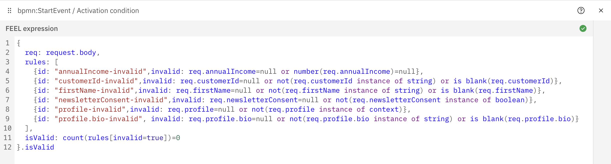
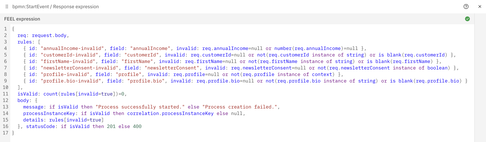

# FEEL Validation Generator

Generate FEEL validation expressions directly from OpenAPI specifications for use in Camunda's Inbound and Intermediate
Webhook Connectors. The plugin eliminates manual validation logic and keeps your payload checks aligned with the contract
that already describes your API.

## Why This Plugin?

When exposing processes through Camunda's webhook connectors (Inbound or Intermediate) you must validate payloads before
your BPMN actually kicks off. Rather than writing FEEL expressions by hand, this plugin parses the OpenAPI document and
emits the validation logic for you.

**Benefits**
- **Single Source of Truth** – Keep validation rules beside the OpenAPI spec and avoid duplicating constraints.
- **Handles Complexity** – Understands nested objects, `$ref`, `allOf`, `anyOf`, and `oneOf` structures.
- **Strong Typing** – Generates FEEL checks for strings, contexts, arrays, booleans, and numbers.
- **Fast Integration** – Copy the generated FEEL into Camunda Web Modeler without manual tweaks.
- **Flexible Output** – Use the result as either an activation condition or a detailed response expression.

## Project Layout

- `plugin/` – The Maven plugin. This module contains the generator, tests, and plugin metadata.
- `example/` – A sample consumer. It includes a small OpenAPI file and runs the plugin during its build to produce a
  FEEL file under `example/target/generated-feel`.

## What It Does

1. **Parses** your OpenAPI 3 document (JSON or YAML).
2. **Extracts required fields** from request bodies, resolving nested contexts and references.
3. **Generates FEEL** rules that validate null checks, types, and non-blank strings.
4. **Renders output** grouped per HTTP method + path so you can copy each block into Camunda.
5. **Supports two modes**:
   - **Activation condition** (`addResponse=false`) – Boolean output for `activationCondition`.
   - **Response expression** (`addResponse=true`) – Structured context for `responseExpression`.

## How to Use

### 1. Add the Plugin to Your Project

```xml
<build>
  <plugins>
    <plugin>
      <groupId>com.consid.bpm.camunda</groupId>
      <artifactId>feel-validation-generator</artifactId>
      <version>1.0.0</version>
      <executions>
        <execution>
          <goals>
            <goal>generate-feel</goal>
          </goals>
          <configuration>
            <openApiSpec>${project.basedir}/src/main/resources/openapi.yaml</openApiSpec>
            <outputFile>${project.build.directory}/feel/validation.feel</outputFile>
            <addResponse>false</addResponse>
          </configuration>
        </execution>
      </executions>
    </plugin>
  </plugins>
</build>
```

Or run it directly:

```bash
mvn com.consid.bpm.camunda:feel-validation-generator:1.0.0:generate-feel \
  -DfeelValidationGenerator.openApiSpec=src/main/resources/openapi.yaml \
  -DfeelValidationGenerator.outputFile=target/validation.feel
```

### 2. Try the Bundled Example

```bash
mvn -pl example -am package
```

The reactor builds the plugin module, then executes it inside `example/`. Inspect
`example/target/generated-feel/customer-validation.feel` to see the FEEL generated for the sample `POST /customers`
schema defined in `example/src/main/resources/openapi/example-api.json`. Every snippet below is taken directly from that
example.

## Configuration Options

- `openApiSpec` *(required)* – Path to the OpenAPI document (JSON or YAML).
- `outputFile` *(required)* – Destination file for the generated FEEL.
- `addResponse` *(optional, default `false`)* – Toggle response-expression mode.
- `successStatusCode` *(optional, default `201`)* – HTTP status used when the response expression evaluates to
  success.
- `failStatusCode` *(optional, default `400`)* – HTTP status used when validation fails in response mode.

### Builder API

```java
FEELValidationGenerator generator = FEELValidationGenerator.builder()
    .withOpenApiPath("src/main/resources/api.yaml")
    .withOutputFilePath("target/validation.feel")
    .withResponse(true)
    .withSuccessCode(202)
    .withFailCode(422)
    .withHttpMethods(List.of("POST"))
    .build();
generator.generate();
```

## Configuration Examples

### Option 1 – Activation Condition (`addResponse=false`)

Use this mode when you want the connector to start the process **only** when the payload is valid. The generated FEEL
returns `true` or `false`, making it perfect for the `activationCondition` field.

```xml
<configuration>
  <openApiSpec>${project.basedir}/src/main/resources/openapi.yaml</openApiSpec>
  <outputFile>${project.build.directory}/feel/validation.feel</outputFile>
  <addResponse>false</addResponse>
</configuration>
```

Generated FEEL for the sample `POST /customers`:

```feel
# POST /customers
{
  req: request.body,
  rules: [
    {
      id: "annualIncome-invalid",
      invalid: req.annualIncome=null or number(req.annualIncome)=null
    },
    {
      id: "customerId-invalid",
      invalid: req.customerId=null or not(req.customerId instance of string) or is blank(req.customerId)
    },
    {
      id: "firstName-invalid",
      invalid: req.firstName=null or not(req.firstName instance of string) or is blank(req.firstName)
    },
    {
      id: "newsletterConsent-invalid",
      invalid: req.newsletterConsent=null or not(req.newsletterConsent instance of boolean)
    },
    {
      id: "profile-invalid",
      invalid: req.profile=null or not(req.profile instance of context)
    },
    {
      id: "profile.bio-invalid",
      invalid: req.profile.bio=null or not(req.profile.bio instance of string) or is blank(req.profile.bio)
    }
  ],
  isValid: count(rules[invalid=true])=0
}.isValid
```

#### Example in Web Modeler

<p align="center">
  
</p>

**Success response** – The activation condition does not itself craft the response. The connector still evaluates your
regular response expression when the condition returns `true`, e.g.:

```feel
{
  body: {
    message: "Process successfully started.",
    processInstanceKey: correlation.processInstanceKey,
  }, statusCode: 201
}
```

Resulting in:

```json
{
  "body": {
    "message": "Process successfully started.",
    "processInstanceKey": 221345678901,
  }, "statusCode": 201
}
```

**Failure response** – When the activation condition evaluates to `false`, the connector refuses the call before the
process starts and returns a static payload:

```json
{
  "body": { 
    "message": "activation condition not met" 
  }, "statusCode": 422
}
```

### Option 2 – Response Expression (`addResponse=true`)

Use this when you want to return a detailed validation report to the caller. The generated FEEL is a context object that
includes the validation outcome, a body, and a status code. Paste it into the connector's `responseExpression` field.

```xml
<configuration>
  <openApiSpec>${project.basedir}/src/main/resources/openapi.yaml</openApiSpec>
  <outputFile>${project.build.directory}/feel/validation.feel</outputFile>
  <addResponse>true</addResponse>
</configuration>
```

Need different HTTP statuses? Add `<successStatusCode>` / `<failStatusCode>` to the configuration above.

Generated FEEL for the example:

```feel
# POST /customers
{
  req: request.body,
  rules: [
    {
      id: "annualIncome-invalid",
      field: "annualIncome",
      invalid: req.annualIncome=null or number(req.annualIncome)=null
    },
    {
      id: "customerId-invalid",
      field: "customerId",
      invalid: req.customerId=null or not(req.customerId instance of string) or is blank(req.customerId)
    },
    {
      id: "firstName-invalid",
      field: "firstName",
      invalid: req.firstName=null or not(req.firstName instance of string) or is blank(req.firstName)
    },
    {
      id: "newsletterConsent-invalid",
      field: "newsletterConsent",
      invalid: req.newsletterConsent=null or not(req.newsletterConsent instance of boolean)
    },
    {
      id: "profile-invalid",
      field: "profile",
      invalid: req.profile=null or not(req.profile instance of context)
    },
    {
      id: "profile.bio-invalid",
      field: "profile.bio",
      invalid: req.profile.bio=null or not(req.profile.bio instance of string) or is blank(req.profile.bio)
    }
  ],
  isValid: count(rules[invalid=true])=0,
  body: {
    message: if isValid then "Process successfully started." else "Process creation failed.",
    processInstanceKey: if isValid then correlation.processInstanceKey else null,
    details: rules[invalid=true]
  }, statusCode: if isValid then 201 else 400
}
```

#### Example in Web Modeler

<p align="center">
  
</p>

**Success response**:

```json
{
  "body": {
    "message": "Process successfully started.",
    "processInstanceKey": 221345678901,
    "details": []
  }, "statusCode": 201
}
```

**Failure response** (missing `profile.bio`):

```json
{
  "body": {
    "message": "Process creation failed.",
    "processInstanceKey": null,
    "details": [
      { "id": "profile.bio-invalid", "field": "profile.bio", "invalid": true }
    ]
  }, "statusCode": 400
}
```

## Important Trade-offs

The generated FEEL never decides whether a process instance is created. The Web Modeler field you paste it into does:

- **Response expression** – The webhook always starts a process instance and only then evaluates the FEEL. Returning a
  detailed error body is possible, but you must add a script task (or similar) that re-validates the payload and
  terminates the process yourself when it is invalid.
- **Activation condition** – The webhook evaluates the FEEL *before* starting the process. Invalid payloads never
  instantiate the BPMN, but callers only receive the static `{ body: { message: "activation condition not met" },
  statusCode: 422 }` response.

Choose the mode that best supports your use case.
