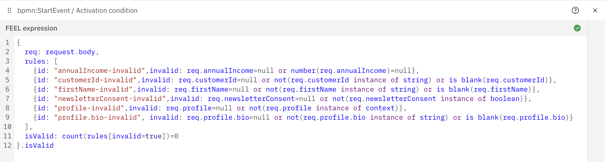
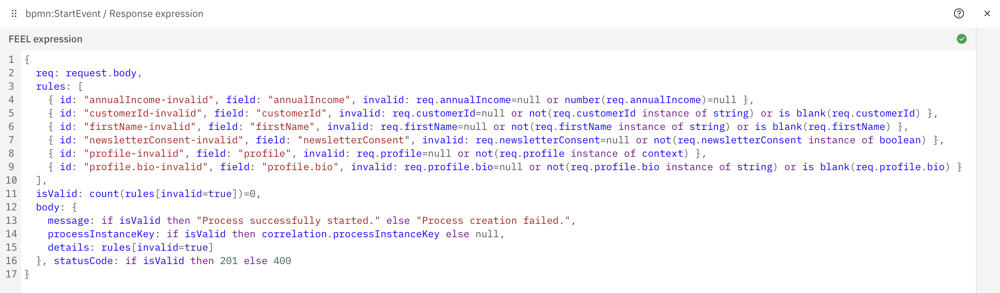

# FEEL Validation Generator

Maven plugin that reads an OpenAPI 3.x document and emits FEEL validation expressions for Camunda webhook connectors (Inbound and Intermediate). Drop the output into the connector's `activationCondition` or `responseExpression` field to keep payload validation aligned with your API contract.

Java 21, no DI framework, three runtime dependencies (`swagger-parser`, `jackson-databind`, slf4j is test-only).

## Modules

- `plugin/` — the Maven plugin (`maven-plugin` packaging).
- `example/` — a pom-only consumer; `mvn -pl example -am package` writes
  [example/target/generated-feel/customer-validation.feel](example/) for the
  [bundled sample spec](example/src/main/resources/openapi/example-api.json).

## Usage

```xml
<plugin>
  <groupId>com.consid.automation.camunda</groupId>
  <artifactId>feel-validation-generator</artifactId>
  <version>1.0.0</version>
  <executions>
    <execution>
      <goals><goal>generate-feel</goal></goals>
      <configuration>
        <openApiSpec>${project.basedir}/src/main/resources/openapi.yaml</openApiSpec>
        <outputFile>${project.build.directory}/feel/validation.feel</outputFile>
        <addResponse>false</addResponse>
      </configuration>
    </execution>
  </executions>
</plugin>
```

CLI form:

```bash
mvn com.consid.automation.camunda:feel-validation-generator:1.0.0:generate-feel \
  -DfeelValidationGenerator.openApiSpec=src/main/resources/openapi.yaml \
  -DfeelValidationGenerator.outputFile=target/validation.feel
```

## Configuration

| Parameter | Property | Default | Notes |
|---|---|---|---|
| `openApiSpec` | `feelValidationGenerator.openApiSpec` | — | Required. Path to the OpenAPI 3.x document (JSON or YAML). |
| `outputFile` | `feelValidationGenerator.outputFile` | — | Required. FEEL output destination; parent dirs are created. |
| `addResponse` | `feelValidationGenerator.addResponse` | `false` | `true` emits a response expression, `false` an activation condition. |
| `successStatusCode` | `feelValidationGenerator.successStatusCode` | `201` | HTTP status used in response mode when validation passes. |
| `failStatusCode` | `feelValidationGenerator.failStatusCode` | `400` | HTTP status used in response mode when validation fails. |
| `methods` | `feelValidationGenerator.methods` | `POST,PUT,PATCH` | Comma-separated HTTP methods to scan. |
| `mediaType` | `feelValidationGenerator.mediaType` | `application/json` | Request body media type to read schemas from. |

Status codes must be in 100–599 or `build()` throws. Path parameters are validated at `build()`; absent required parameters fail fast.

## Programmatic use

```java
FEELValidationGenerator.builder()
    .withOpenApiPath(Path.of("src/main/resources/api.yaml"))
    .withOutputFilePath(Path.of("target/validation.feel"))
    .withResponse(true)
    .withSuccessStatusCode(202)
    .withFailStatusCode(422)
    .withHttpMethods(List.of("POST"))
    .withMediaType("application/json")
    .build()
    .generate();
```

## Type mapping

Each required field from the resolved schema turns into one FEEL rule. The
violation expression is wrapped with `field=null or …` for required fields and
`field!=null and (…)` when the schema marks the field nullable.

| OpenAPI type / format | FEEL check |
|---|---|
| `type: string` | `not(X instance of string) or is blank(X)` |
| `type: string, format: date` | `date(X)=null` |
| `type: string, format: date-time` | `date and time(X)=null` |
| `type: string, format: time` | `time(X)=null` |
| `type: number` / `type: integer` | `not(X instance of number)` |
| `type: boolean` | `not(X instance of boolean)` |
| `type: array` | `not(X instance of list) or is empty(X)` |
| `type: object` | `not(X instance of context)` |
| unrecognised / missing | `null`-check only |

Additional constraints applied on top of the type check:

- **`enum`** — appends `or not(X in (…))` with quoted strings, bare numbers, bare booleans.
- **`nullable: true`** (OpenAPI 3.0) and **`type: […, "null"]`** (OpenAPI 3.1) — switch from required-form to `X!=null and (…)`.

Compositions (`allOf` / `oneOf` / `anyOf`) and `$ref` are resolved. Shared component schemas referenced from multiple paths are expanded at every reference. A `$ref` that can't be resolved fails the build.

## Output modes

### Activation condition (`addResponse=false`)

Boolean expression intended for the connector's `activationCondition` field. Invalid payloads never start a process instance; the caller receives the connector's static fallback (`statusCode: 422`, `body: { message: "activation condition not met" }`).

```feel
# POST /customers
{
  req: request.body,
  rules: [
    {id: "annualIncome-invalid", invalid: req.annualIncome=null or not(req.annualIncome instance of number)},
    {id: "customerId-invalid", invalid: req.customerId=null or not(req.customerId instance of string) or is blank(req.customerId)},
    {id: "firstName-invalid", invalid: req.firstName=null or not(req.firstName instance of string) or is blank(req.firstName)},
    {id: "newsletterConsent-invalid", invalid: req.newsletterConsent=null or not(req.newsletterConsent instance of boolean)},
    {id: "profile-invalid", invalid: req.profile=null or not(req.profile instance of context)},
    {id: "profile.bio-invalid", invalid: req.profile.bio=null or not(req.profile.bio instance of string) or is blank(req.profile.bio)}
  ],
  isValid: count(rules[invalid=true])=0
}.isValid
```



### Response expression (`addResponse=true`)

Context expression intended for the connector's `responseExpression` field. The webhook **always** starts a process instance; the FEEL only shapes the HTTP response body and status. If you want invalid payloads to halt the BPMN, add a script task that re-validates and terminates.

```feel
# POST /customers
{
  req: request.body,
  rules: [
    { id: "annualIncome-invalid", field: "annualIncome", invalid: req.annualIncome=null or not(req.annualIncome instance of number) },
    { id: "customerId-invalid", field: "customerId", invalid: req.customerId=null or not(req.customerId instance of string) or is blank(req.customerId) },
    { id: "firstName-invalid", field: "firstName", invalid: req.firstName=null or not(req.firstName instance of string) or is blank(req.firstName) },
    { id: "newsletterConsent-invalid", field: "newsletterConsent", invalid: req.newsletterConsent=null or not(req.newsletterConsent instance of boolean) },
    { id: "profile-invalid", field: "profile", invalid: req.profile=null or not(req.profile instance of context) },
    { id: "profile.bio-invalid", field: "profile.bio", invalid: req.profile.bio=null or not(req.profile.bio instance of string) or is blank(req.profile.bio) }
  ],
  isValid: count(rules[invalid=true])=0,
  body: {
    message: if isValid then "Process successfully started." else "Process creation failed.",
    processInstanceKey: if isValid then correlation.processInstanceKey else null,
    details: rules[invalid=true]
  }, statusCode: if isValid then 201 else 400
}
```



## Build

```bash
mvn -pl plugin verify          # tests + 80% line-coverage gate
mvn -pl example -am package    # build plugin and run it against the bundled spec
```
